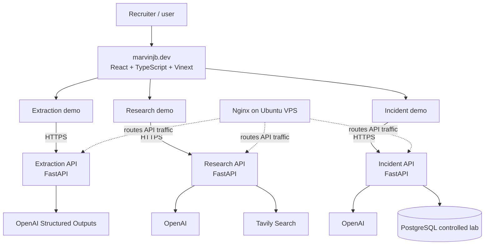

# Marvin Joseph B. — AI Engineering Portfolio

Production SQL Server DBA transitioning into AI and generative AI engineering, building reliable AI systems with Python, FastAPI, LLMs, agentic workflows, structured outputs, evaluation, Docker, and production infrastructure.

## Portfolio

[Visit marvinjb.dev](https://marvinjb.dev)

The portfolio is the presentation layer for three independently implemented AI systems. Each demo has its own frontend experience here and communicates over HTTPS with a separate backend service.

## Featured AI Systems

### Incident Investigation Agent

Investigates genuine controlled application and PostgreSQL incidents through restricted diagnostic tools. It produces an evidence-backed diagnosis, creates an application-owned remediation proposal, requires explicit human approval, executes only an allowlisted demo action, and verifies recovery with an audit trail.

- [Live demo](https://marvinjb.dev/demo/incident-investigation)
- [Backend repository](https://github.com/marvinjbb/incident-investigation-agent)

### Research Agent

Plans one research request into two to five focused assignments, runs bounded workers concurrently, searches with Tavily, preserves application-owned evidence, aggregates deterministically, and synthesizes a report with validated citations, conflicts, and uncertainties.

- [Live demo](https://marvinjb.dev/demo/research)
- [Backend repository](https://github.com/marvinjbb/research-agent)

### Extraction Agent

Routes invoices through text-first PDF extraction or a bounded vision path, requests OpenAI Structured Outputs, and validates the result against an application-owned Pydantic `Invoice` contract before the frontend renders structured fields and optional document Q&A.

- [Live demo](https://marvinjb.dev/demo/extraction)
- [Backend repository](https://github.com/marvinjbb/extraction-agent)

The public demo uses the deployed Extraction service. This repository does not claim that the latest backend repository revision is the currently deployed revision.

## Portfolio Architecture



The browser contains no provider credentials or agent logic. It validates user input, calls the configured public API boundaries, validates response shapes, and presents progress, results, and failures. See [Architecture](docs/ARCHITECTURE.md) for the service and security boundaries.

## Technology

**Frontend**

- React 19, TypeScript, CSS
- Vinext and Vite
- Node.js 22

**AI and backend systems**

- Python, FastAPI, Pydantic
- OpenAI APIs and Structured Outputs
- Tavily search
- PostgreSQL

**Infrastructure and delivery**

- Docker, Nginx, Ubuntu VPS, HTTPS
- Hostinger frontend hosting
- Cloudflare-backed build/runtime tooling and public DNS where configured
- GitHub Actions for frontend validation

Backend implementation details live in the three backend repositories rather than this frontend repository.

## Local Development

### Prerequisites

- Node.js `>=22.13.0`
- npm
- Optional: locally running agent APIs for interactive demo calls

### Install and run

```bash
npm ci
copy .env.example .env.local
npm run dev
```

On macOS or Linux, use `cp .env.example .env.local` instead of `copy`.

`.env.example` contains local API URL placeholders only. Provider keys belong in the backend repositories and must never be added to this frontend.

### Verify

```bash
npm run lint
npm test
npm run build
```

`npm test` performs a production build before running the Node test suite. The test suite exercises API response guards, demo behavior, rendered routes, public links, and key content invariants.

## Deployment

The Vinext frontend is built from this repository and served by the established Hostinger workflow. Public `NEXT_PUBLIC_*` variables select the three HTTPS API boundaries. The independently deployed FastAPI services run in Docker on an Ubuntu VPS behind Nginx and `api.marvinjb.dev`.

See [Deployment](docs/DEPLOYMENT.md) for frontend commands, configuration names, verification, and rollback principles. Backend deployment procedures remain in their respective repositories.

## Repository Structure

```text
app/                 Homepage, shared navigation, and three demo routes
app/demo/            Extraction, Research, and Incident demo interfaces
docs/                Architecture, deployment, decisions, and roadmap
public/              Public images, credential artwork, and résumé PDF
tests/               Node tests for APIs, rendered HTML, and demo UX
worker/              Vinext/Cloudflare-compatible worker entry point
.github/workflows/   Validation-only CI
```

## Engineering Principles

- Prefer evidence over unsupported model claims.
- Validate provider output and frontend response shapes explicitly.
- Keep tools, concurrency, and public actions bounded.
- Require human approval before a demo performs controlled remediation.
- Fail closed when configuration, validation, or provider behavior is unsafe.
- Keep secrets in backend runtime environments, never in browser code.
- Test the same build path used for production delivery.

## Articles

- [We're Giving AI Agents Tools, Memory, and Permissions. What Could Go Wrong?](https://medium.com/@jbmarvin21/were-giving-ai-agents-tools-memory-and-permissions-what-could-go-wrong-630294132412?sharedUserId=jbmarvin21)
- [The AI Study Loop I Used to Pass the Claude Certified Associate Exam](https://medium.com/@jbmarvin21/the-ai-study-loop-i-used-to-pass-the-claude-certified-associate-exam-7d7ad25361a9)

## Contact

- [Portfolio](https://marvinjb.dev)
- [GitHub](https://github.com/marvinjbb)
- [LinkedIn](https://www.linkedin.com/in/marvin-jbb)
- [Email](mailto:jbmarvin21@gmail.com)

## Additional Documentation

- [Architecture](docs/ARCHITECTURE.md)
- [Deployment](docs/DEPLOYMENT.md)
- [Security](SECURITY.md)
- [Contributing](CONTRIBUTING.md)
- [Architecture decisions](docs/DECISIONS.md)
- [Project roadmap](docs/ROADMAP.md)
