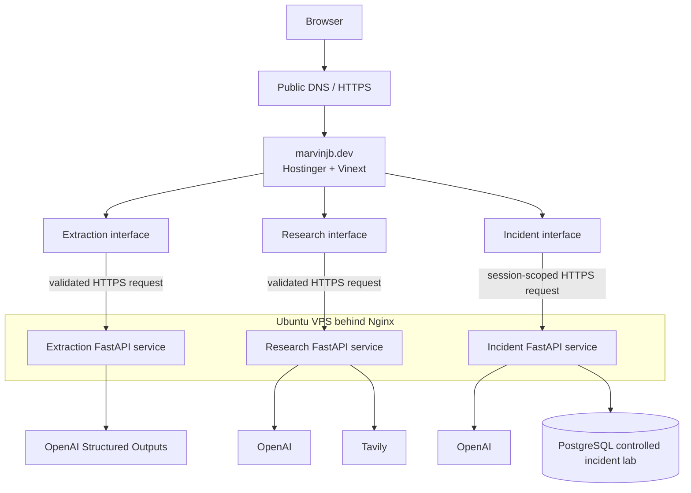

# Portfolio Architecture

## Purpose and scope

`marvinjb.dev` is the public presentation layer for three independently implemented AI systems. This repository owns the homepage, project case studies, interactive demo interfaces, client-side response validation, and user-facing error states. It does not contain provider credentials or backend agent implementations.

The backend services remain in separate repositories because they have different contracts, dependencies, safety boundaries, deployment histories, and scaling constraints:

- [Incident Investigation Agent](https://github.com/marvinjbb/incident-investigation-agent)
- [Research Agent](https://github.com/marvinjbb/research-agent)
- [Extraction Agent](https://github.com/marvinjbb/extraction-agent)

## System view

Nginx is the public API reverse proxy. It routes the service-specific HTTPS paths on `api.marvinjb.dev` to isolated Docker containers. The frontend receives only the structured public responses exposed by those services.

## Frontend responsibility

The frontend:

- Presents the homepage, case studies, and interactive demos.
- Validates basic user input before sending it.
- Reads public API base URLs from environment variables.
- Applies request timeouts appropriate to each workflow.
- Sends browser credentials only where the session-scoped Incident demo requires them.
- Validates important response shapes before rendering them.
- Displays honest loading, success, partial-failure, and error states.
- Safely links citations and external project resources.

The frontend does not parse documents, call model providers directly, search the web, run diagnostic tools, or execute remediation.

## Demo and backend boundaries

### Extraction

The browser uploads one supported invoice to the Extraction API. The backend owns file validation, PDF text extraction, text-versus-vision routing, OpenAI Structured Outputs, Pydantic validation, and optional invoice Q&A. Uploaded documents and provider credentials are not stored in this frontend.

### Research

The browser submits one question and `quick` or `deep` depth. The backend owns planning, two-to-five bounded workers, Tavily searches, application-owned evidence identifiers, deterministic aggregation, synthesis, and final citation validation. The frontend displays an estimated progress sequence because the current API returns one completed report rather than live worker events.

### Incident Investigation

The browser selects one allowlisted synthetic incident. The backend owns session-scoped incident creation, restricted diagnostics, evidence collection, model investigation, application-owned remediation proposals, approval state, allowlisted execution, recovery verification, and the audit trail. The browser cannot supply SQL, process identifiers, deployment versions, shell commands, or arbitrary infrastructure targets.

## Environment-based API routing

The three API modules read these public frontend variables:

- `NEXT_PUBLIC_EXTRACTION_API_BASE_URL`
- `NEXT_PUBLIC_RESEARCH_API_BASE_URL`
- `NEXT_PUBLIC_INCIDENT_API_BASE_URL`

They contain URL routing information only. Because `NEXT_PUBLIC_*` values are embedded into the browser build, they must never contain API keys, passwords, provider tokens, or private endpoints.

Local defaults are documented in `.env.example`. Production values are supplied by the frontend hosting environment and map to the HTTPS routes exposed through `api.marvinjb.dev`.

## Request flow

1. A visitor opens a demo on `marvinjb.dev`.
2. The frontend validates the immediate input and builds the documented request.
3. The browser calls the configured HTTPS API boundary.
4. Nginx routes the request to the correct Dockerized FastAPI service.
5. That service validates the request and invokes only its approved providers and tools.
6. The backend validates its result and returns structured JSON.
7. The frontend validates the response shape and renders the result or a bounded error state.

## Failure boundaries

- A missing frontend API URL fails as configuration, before a provider request.
- Network, timeout, validation, rate-limit, and backend failures remain distinguishable where the API exposes enough information.
- Each backend can fail independently without importing or sharing application logic with another agent.
- The Research frontend rejects malformed reports rather than rendering unvalidated citations.
- The Extraction frontend rejects malformed invoice results.
- The Incident frontend requires the backend's session and approval lifecycle; it cannot manufacture a successful remediation state.
- Provider or backend failures do not expose raw prompts, provider responses, or credentials through the interface.

## Security boundaries

- Provider credentials exist only in backend runtime environments.
- Public frontend variables hold API base URLs only.
- Backend CORS policies authorize the public portfolio origin explicitly.
- External source and repository links use safe new-tab behavior.
- The Incident demo uses `credentials: include` for its bounded, session-owned workflow.
- Uploaded invoices should be synthetic or non-sensitive; browser delivery does not make a public demo an appropriate place for confidential documents.
- Backend authorization, tool allowlists, rate limits, evidence validation, and deployment safeguards are maintained in the backend repositories.

## Why separate repositories

Separate repositories keep each agent understandable and deployable on its own. They prevent frontend changes from silently modifying provider logic, let each backend maintain its own tests and security documentation, and make deployment status explicit. The services share a small portfolio VPS for cost-appropriate hosting, not a shared application codebase.

This is a portfolio-scale architecture: one public portfolio, one API hostname, one VPS, and isolated services. A larger production organization could add independent environments, centralized observability, managed data services, stronger identity, and horizontally scalable coordination when traffic and availability requirements justify them.
